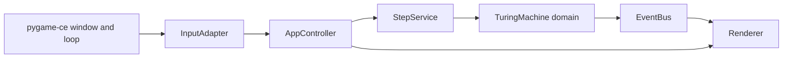

# Turing Machine Visualizer

[](https://github.com/Tpanarchist/TuringMachine/actions/workflows/ci.yml)


A desktop Turing machine simulator and visualizer built with Python 3.12,
[`pygame-ce`](https://pyga.me/), and
[`transitions`](https://github.com/pytransitions/transitions).
It keeps the runtime Turing machine deterministic while the app shell stays
interactive and teachable.

Phase 1 also adds a high-level ternary agent authoring layer that compiles into
the existing flat TM schema rather than changing the runtime engine.


## Why this project

- Run bundled Turing machine demos such as unary increment, binary increment,
  and the 2-state busy beaver.
- Step one transition at a time or run continuously at adjustable speed.
- Watch machine state, active rule, tape head, and event history update live.
- Explore an architecture that keeps domain semantics, controller logic, UI
  rendering, and high-level authoring concerns separate.

## Quick Start

### Windows

```powershell
py -3.12 -m venv .venv
.venv\Scripts\Activate.ps1
python -m pip install --upgrade pip
pip install -e .[dev]
python -m tmviz
```

### Linux / macOS

```bash
python3.12 -m venv .venv
source .venv/bin/activate
python -m pip install --upgrade pip
pip install -e .[dev]
python -m tmviz
```

The app starts with the first bundled spec, opens a resizable terminal-style
window, and enforces a minimum size of `960x600`.

You can also point `--spec` at a high-level authored agent file and let the
factory compile it before runtime construction:

```bash
python -m tmviz --spec examples/minimal_three_office.agent.json
```

## Developer Commands

```bash
python -m tmviz
python -m tmviz --help
pytest -q
ruff check
mypy src
```

After an editable install you can also launch the simulator with:

```bash
tmviz
```

## CI

GitHub Actions runs the reproducible project checks in
[`.github/workflows/ci.yml`](.github/workflows/ci.yml) on pushes to `main` and
on pull requests. The workflow is pinned to Python `3.12` and runs:

- `ruff check`
- `mypy src`
- `pytest -q`
- `python -m tmviz --help`

## Controls

| Key | Action |
| --- | --- |
| `Space` | Toggle run / pause |
| `N` | Execute one full transition |
| `R` | Reset the loaded machine |
| `L` | Cycle to the next bundled machine spec |
| `C` | Publish and log a center-head event |
| `G` | Toggle tape grid rendering |
| `1` | Set speed to `1.0` steps/sec |
| `2` | Set speed to `2.0` steps/sec |
| `3` | Set speed to `5.0` steps/sec |
| `Esc` | Quit |

## Bundled Machines

| Spec | What it demonstrates |
| --- | --- |
| `specs/unary_increment.json` | A minimal machine that appends one unary mark and halts. |
| `specs/binary_increment.json` | Carry logic, left/right movement, and a more interesting transition table. |
| `specs/busy_beaver_2state.json` | A classic small busy beaver configuration with compact rules and obvious tape growth. |

## What You See On Screen

The UI is intentionally dense but structured around one dominant idea: the tape
is the primary workspace.

- **HUD**: machine name, app state, current phase, speed, and compact key hints
- **Tape field**: the active tape window with the current head highlighted
- **Inspector**: state vector, current rule, last rule, and status block
- **Event rail**: the most recent published simulator events

Additional screenshots:

- 
- 

## How The Simulator Works

At runtime the project keeps two layers separate:

1. The **domain engine** holds tape contents, head position, control state, and
   the transition table.
2. The **application shell** handles commands, phases, timing, rendering, and
   event publication.



One machine transition can be shown as a micro-pipeline:

`fetch -> lookup -> write -> move -> commit`

The controller uses a hierarchical `transitions` state machine to move between
boot, idle, loaded, running sub-phases, paused, halted, and error states.

## Machine Spec At A Glance

Runtime machine definitions live in JSON under `specs/` and are validated
before they become runtime objects.

```json
{
  "name": "Unary Increment",
  "blank_symbol": "_",
  "states": ["q0", "halt"],
  "start_state": "q0",
  "accept_states": ["halt"],
  "reject_states": [],
  "alphabet": ["1", "_"],
  "initial_tape": ["1", "1", "1", "_"],
  "initial_head": 0,
  "rules": [
    ["q0", "1", "q0", "1", "R"],
    ["q0", "_", "halt", "1", "S"]
  ]
}
```

Each rule row follows:

```text
[current_state, read_symbol, next_state, write_symbol, move_direction]
```

Supported directions are `L`, `R`, and `S`. The full schema, defaults, and
validation rules are documented in
[docs/spec-reference.md](docs/spec-reference.md).

## High-Level Agent Authoring

High-level ternary agent specs are separate from the raw bundled TM specs in
`specs/`. They live outside `specs/`, compile into the exact runtime schema
above, and then flow through `MachineSpecFactory` unchanged. The factory now
accepts those authored mappings and paths directly, so `--spec` can point at a
raw TM JSON file or an authored `.agent.json` file.

Canonical example files:

- `examples/minimal_three_office.agent.json`
- `examples/minimal_three_office.compiled.json`

Authoring shape:

```json
{
  "name": "Minimal Three Office Agent",
  "blank_symbol": "_",
  "alphabet": ["-1", "0", "+1", "_"],
  "initial_tape": ["0", "-1", "+1", "_"],
  "initial_head": 0,
  "start_office": "generator",
  "start_integrity": "seed",
  "paths": [
    ["generator", "arbiter"],
    ["arbiter", "critic"],
    ["critic", "arbiter"],
    ["arbiter", "generator"]
  ]
}
```

Compiled TM shape:

```json
{
  "start_state": "generator__seed",
  "states": [
    "generator__death",
    "generator__seed",
    "generator__life",
    "arbiter__death",
    "arbiter__seed",
    "arbiter__life",
    "critic__death",
    "critic__seed",
    "critic__life"
  ],
  "rules": [
    ["generator__seed", "0", "arbiter__life", "+1", "R"],
    ["critic__life", "+1", "arbiter__seed", "0", "L"],
    ["arbiter__seed", "0", "generator__seed", "0", "S"]
  ]
}
```

Compile API:

```python
import json
from pathlib import Path

from tmviz.compiler import compile_agent_mapping
from tmviz.factory.machine_factory import MachineSpecFactory

raw_agent = json.loads(
    Path("examples/minimal_three_office.agent.json").read_text(encoding="utf-8")
)
compiled = compile_agent_mapping(raw_agent)
machine = MachineSpecFactory().from_mapping(compiled.to_mapping())
```

Or load the authored file directly through the normal app entry point:

```bash
python -m tmviz --spec examples/minimal_three_office.agent.json
```

### CLI: compile authored AgentSpec to TM JSON

You can use the small CLI to produce a compiled TM JSON file from a high-level
agent spec. After an editable install the command is available as `tmviz-compile`.

Example (write to stdout):

```bash
tmviz-compile examples/minimal_three_office.agent.json
```

Example (write to file):

```bash
tmviz-compile examples/minimal_three_office.agent.json examples/minimal_three_office.compiled.json
```


## Project Layout

```text
src/tmviz/
|-- app/       # controller, commands, app events, step orchestration
|-- compiler/  # high-level agent -> flat TM compilation
|-- domain/    # tape, rules, movements, machine semantics
|-- factory/   # spec normalization, validation, machine construction
|-- graph/     # legal office handoff graph validation
|-- infra/     # event bus, spec loading, logging
|-- model/     # Pydantic ternary agent authoring models
`-- ui/        # pygame rendering, layout, input mapping, theme

examples/      # high-level agent specs and compiled TM snapshots
specs/         # bundled example machines
tests/         # domain, controller, layout, renderer, and spec tests
```

## Documentation Map

- [User Guide](docs/user-guide.md)
- [Machine Spec Reference](docs/spec-reference.md)
- [Architecture Guide](docs/architecture.md)
- [Contribution and Testing Guide](docs/contributing.md)

## Current Status

This repository currently focuses on:

- a correct, tested domain engine
- a compiler that flattens high-level ternary agent specs into raw TM specs
- a `transitions`-driven simulator controller
- a dense terminal-style `pygame-ce` UI
- machine specs loaded from JSON
- pytest and Ruff coverage for the implemented surface

If you want to add new machines, authoring examples, UI refinements, or new
simulator behaviors, start with the docs linked above and then inspect the
corresponding package in `src/tmviz/`.
